Here’s a well-structured README for your project, **Smooth AI**, that includes a long description, emojis, and organized sections to enhance UX.

---

# Smooth AI 🚀

Smooth AI is a cutting-edge platform that empowers users to seamlessly create SaaS websites with integrated AI and 3D AI models! 🎨✨ With just a few clicks, users can build interactive, AI-powered landing pages, integrate chatbots and avatars, and enhance user journeys through lifelike 3D AI models that respond to voice commands and gestures in real-time.

Whether you're a creator, business, or developer, Smooth AI offers an easy way to launch, host, and enhance your website with innovative AI-driven experiences. 🌐💻

---

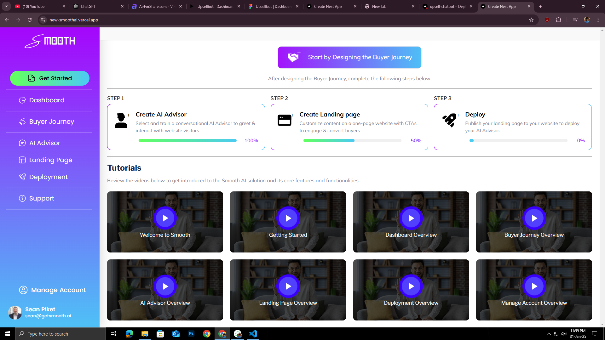
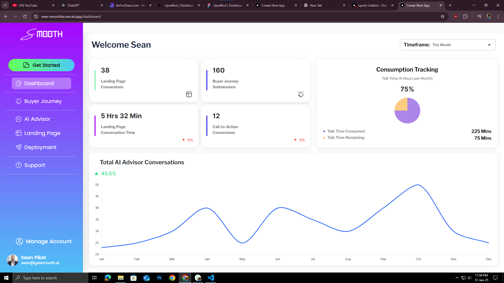
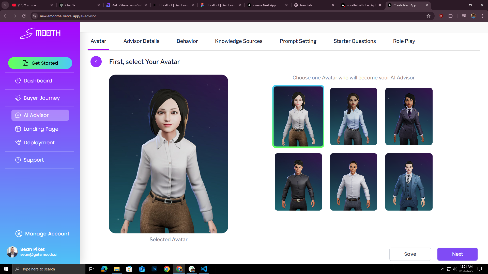
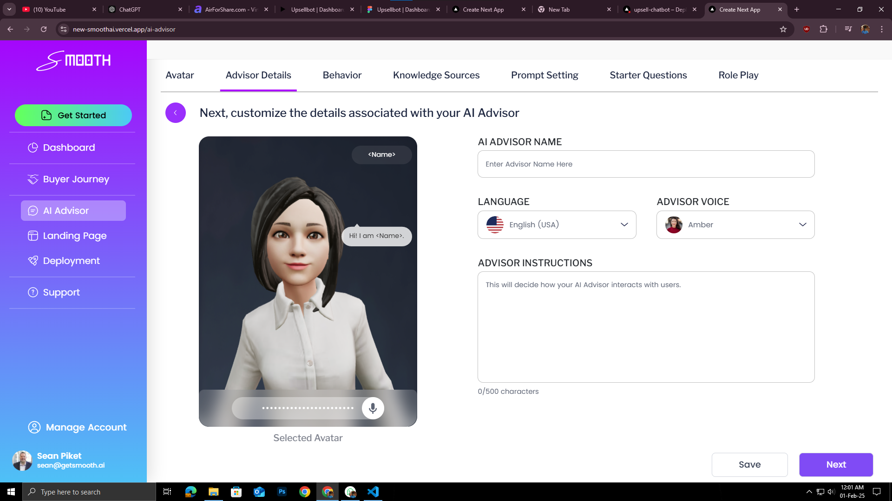
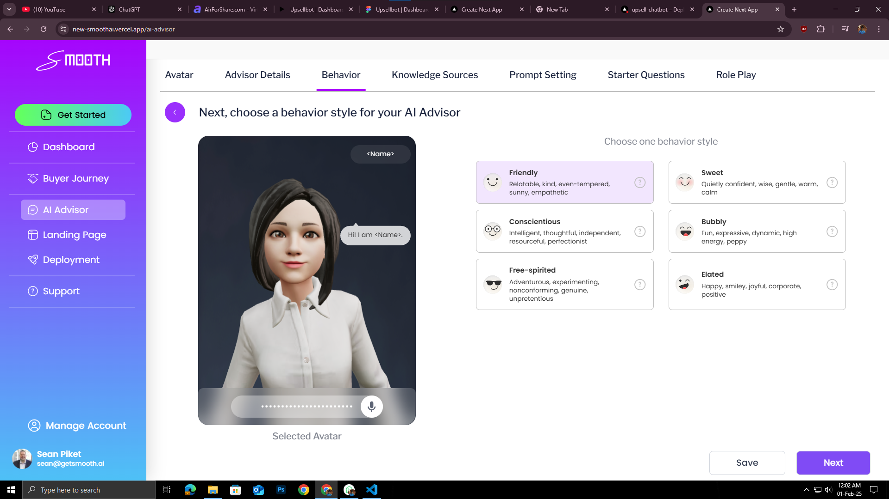
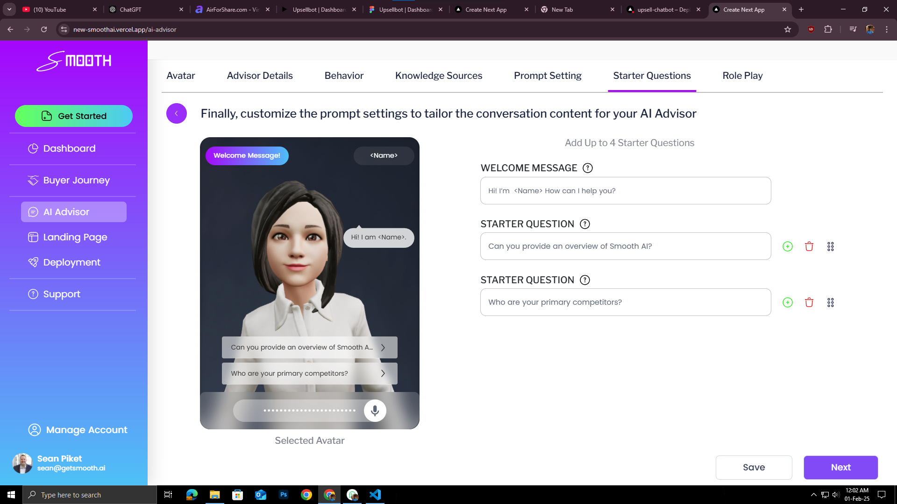
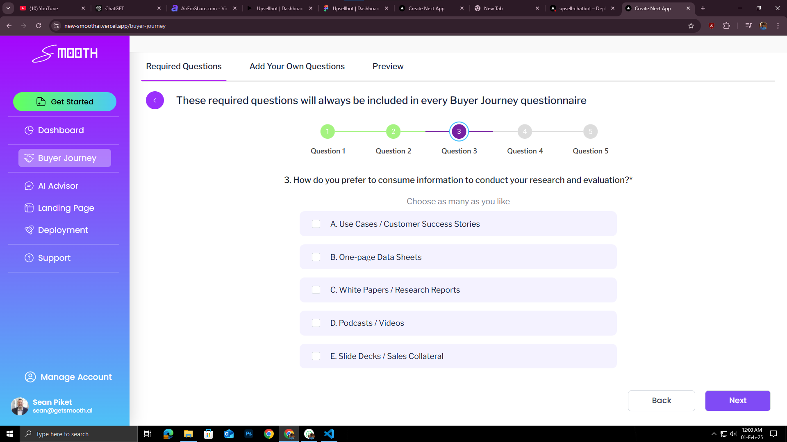
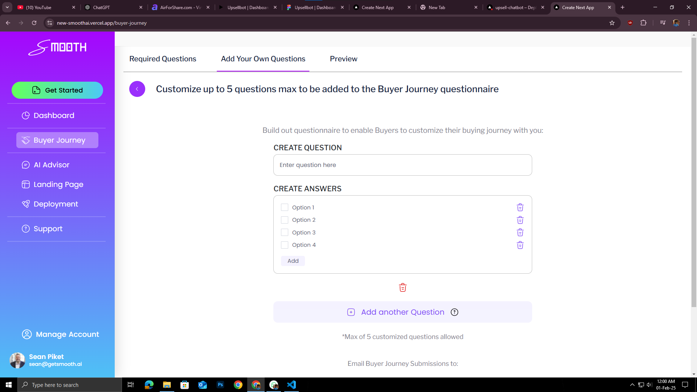
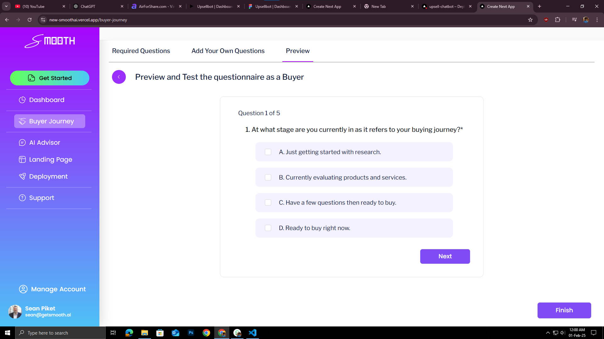
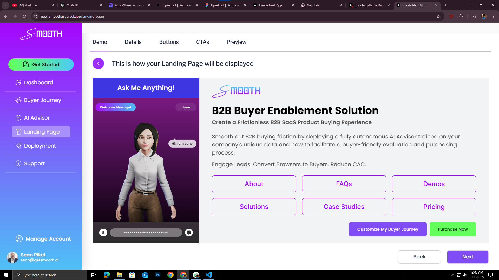
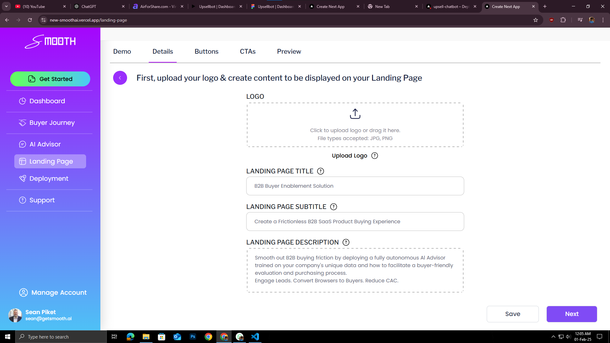
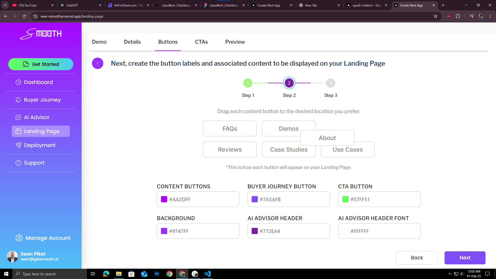
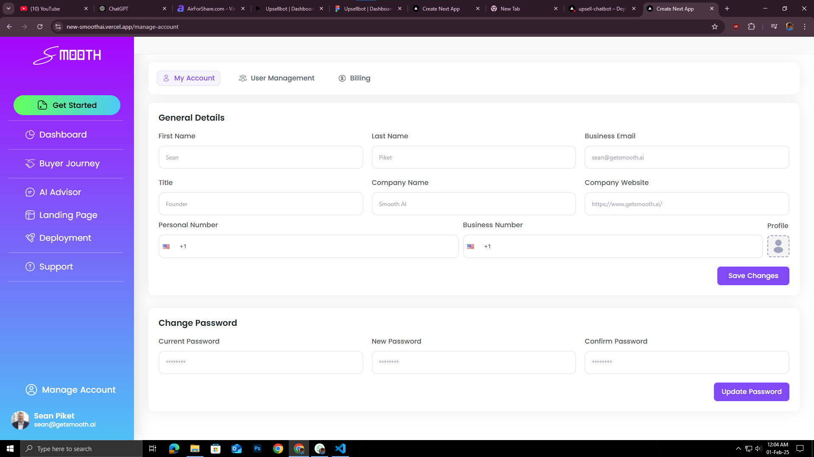
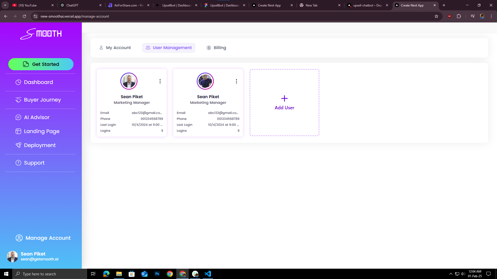
<!--  -->
 

## Key Features ✨

### 1. **No-Code SaaS Platform Creation** 🛠️
   - Quickly create SaaS platforms without needing to write any code.
   - The platform auto-generates beautiful, responsive landing pages based on your selections.
   - Host your landing page on a custom domain with ease.

### 2. **AI-Powered 3D Avatars** 🤖
   - Add interactive 3D AI models to your website that engage with users.
   - Models respond to voice inputs and gestures, offering a fully immersive experience.
   - These avatars guide users through their journey in real-time.

### 3. **Personalized User Journey** 🛤️
   - Smooth AI builds personalized user journeys for each visitor, with AI models offering a unique interaction path.
   - Tailored journeys for e-commerce, customer support, onboarding, and more.

### 4. **Integrated Chatbots** 💬
   - Seamlessly integrate intelligent chatbots into your website.
   - Enhance customer interaction with AI-driven, context-aware conversations.

### 5. **Hosting & Domain** 🏠
   - Smooth AI handles the hosting and provides a custom domain for each user.
   - Automatically publish your landing page with one click.

---

## How It Works ⚙️

1. **Create a Smooth AI Account**  
   Start by signing up and setting up your account on Smooth AI. You’ll have access to a dashboard to begin building your platform.

2. **Design Your Landing Page**  
   With our drag-and-drop interface, you can easily customize the design of your landing page. Choose from various templates and design elements!

3. **Integrate 3D AI Models & Chatbots**  
   Add AI-powered 3D avatars and chatbots to your site. Customize their appearance, behavior, and set specific tasks or journeys for them to guide your users.

4. **Launch & Host**  
   Once you're happy with your creation, hit the launch button! Your landing page will automatically be published on a custom domain.

5. **Engage Your Users**  
   Watch your users interact with the site through voice commands, gestures, and personalized experiences driven by AI.

---

## Benefits 🌟

- **Boost User Engagement**: The interactive 3D AI avatars keep your visitors engaged and provide real-time assistance.
- **Seamless Integration**: Smooth AI is compatible with all websites, no matter the platform.
- **Customizable**: Tailor the AI avatars and chatbots to your branding, ensuring your site reflects your unique identity.
- **Scalable**: Whether you're starting with a small project or scaling up, Smooth AI grows with you.
- **AI-Powered Analytics**: Get insights into how users interact with your AI models and optimize their experience.

---

## Tech Stack 🖥️

- **Frontend**: Built with [Next.js](https://nextjs.org/) and [React 3](https://reactjs.org/) for a fast, responsive UI.
- **3D Rendering**: Powered by [Three.js](https://threejs.org/) for rendering 3D models in the browser.
- **Voice Recognition**: Integrated real-time voice recognition for interacting with the AI models.
- **AI**: Leveraging state-of-the-art Natural Language Processing (NLP) for chatbot and avatar interactions.

---

## Demo 🎥

Check out the live demo of Smooth AI to see the magic in action! (https://new-smoothai.vercel.app/)

---

## Getting Started 💡

### Prerequisites

- Basic knowledge of SaaS platforms (No coding required!).
- Smooth AI account to create your site.
  
### Steps to Get Started

1. Create an account on Smooth AI [Sign Up Link].
2. Customize your landing page with our intuitive editor.
3. Add AI models and chatbots.
4. Host your site on a custom domain.
5. Publish and share your new AI-powered website!

---

## Contributions 🤝

We welcome contributions from developers and enthusiasts! If you’d like to help improve Smooth AI, follow these steps:

1. Fork the repository.
2. Create a new branch (`git checkout -b feature/your-feature-name`).
3. Commit your changes (`git commit -am 'Add new feature'`).
4. Push to the branch (`git push origin feature/your-feature-name`).
5. Open a pull request.

---

## Support 💬

If you encounter any issues or have questions, feel free to reach out to us:

- [Support Email]
- [Discord Channel Link]
- [Community Forum Link]

---

## License 📜

This project is licensed under the MIT License - see the [LICENSE.md](LICENSE.md) file for details.

---

## Acknowledgments 🏆

- Thank you to the [Three.js](https://threejs.org/) and [Next.js](https://nextjs.org/) communities for their incredible libraries.
- Special thanks to the team for making this vision a reality.

---

Ready to create your own AI-powered SaaS platform? Let's get started with **Smooth AI** today! 🌟

